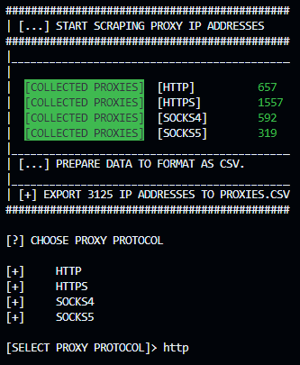
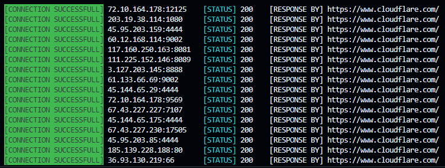

# **ProxyManager**

**This application collects proxy ip addresses, validates the connection state and export the proxies which are using the protocol you prefere.**

## Usage

**[CMD]**

**``python proxymanager.py``**

## Installation

1. ``git clone https://github.com/h4ppym4n14c/ProxyManager.git``

2. `` cd ProxyManager ``

3. `` pip install -r requirements ``

4. `` python proxymanager.py ``

## Information

In the "examples" folder you will find some scraped proxy addresses, sorted by protocol. After you loaded a new dump of a proxies the examples wil be overwritten.